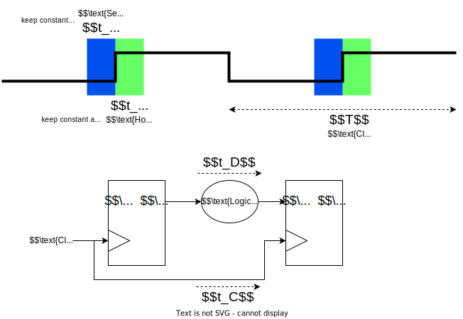

## Definition
The longest path between any two connected flip-flops. 
- Determines the maximum frequency that can be used for the design.

![[timing_constraints.png]]
(from [Lecture 8 - Timing Constraints (ic.ac.uk)](http://www.ee.ic.ac.uk/pcheung/teaching/ee2_digital/Lecture%208%20-%20Timing%20Constraints%20(x2).pdf))